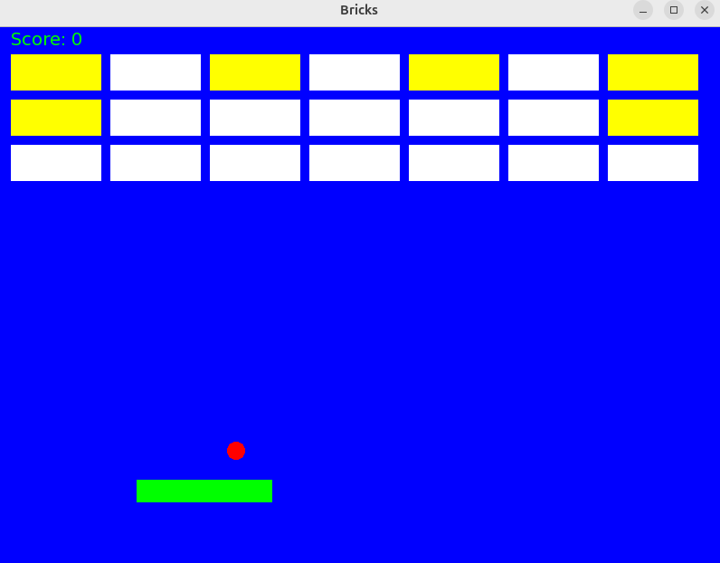

# Breaking Bricks – Game

This implementation of the **Breaking Bricks** game was developed on a **Linux** platform using **C++** and the **SFML multimedia library**. The code is structured using object-oriented programming principles, ensuring modularity and clear separation of game components such as the bricks, ball, and paddle.

---

## Game Rules

**Breaking Bricks** is a classic arcade-style game where the player uses a paddle to keep a bouncing ball in play and destroy bricks on the screen.

### Objective
Break all the **Breakable Bricks** by bouncing the ball off the paddle.

**The game ends when:**
- You **win** by destroying all Breakable Bricks.
- You **lose** if the ball falls below the paddle.

---

### Brick Types

- **Breakable Bricks (White):**  
  These bricks can be broken by the ball. The player must break all breakable bricks to win the game.

- **Stable Bricks (Yellow):**  
  These bricks cannot be broken and do not affect the outcome of the game. The ball bounces off them without destroying them.

---

### Scoring

- Each breakable brick destroyed awards **10 points**.
- The final score is the total number of points earned by breaking bricks.

---

### Controls

- Use the **Left** and **Right arrow keys** to move the paddle horizontally.
- Keep the ball in play by bouncing it off the paddle.

---

---

## Setup and Run the Game

Follow the steps below to build and run the Breaking Bricks game:

```bash
# Clone the repository
git clone https://github.com/NataliaVainstein/BricksGame

# Navigate to the project directory
cd BricksGame

# Compile the game using the Makefile
make

# Run the game
./brickGame
```

---

**Enjoy the game!**
